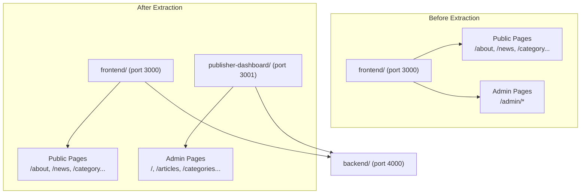

# Design Document: Publisher Dashboard Extraction

## Overview

This design describes the extraction of all admin CMS pages from the `frontend/` Next.js project into a new standalone `publisher-dashboard/` Next.js project at the workspace root. The extraction is a structural migration — no business logic changes. The goal is a clean architectural boundary: `frontend/` serves the public news site, `publisher-dashboard/` serves content managers.

The migration involves:
1. Creating a new Next.js project with matching toolchain (TypeScript, Tailwind CSS v4, vitest + fast-check)
2. Copying all 10 admin pages, the admin layout, the auth context, and the admin fetch helper
3. Transforming import paths and navigation links (dropping the `/admin` prefix)
4. Adding Docker support on port 3001
5. Cleaning up the source project by removing all admin code

Both projects continue to share the same Express.js backend API at port 4000.

## Architecture



### File Migration Map

| Source (frontend/) | Target (publisher-dashboard/) | Notes |
|---|---|---|
| `src/app/admin/layout.tsx` | `src/app/layout.tsx` | Becomes root layout; nav links drop `/admin` prefix |
| `src/app/admin/page.tsx` | `src/app/page.tsx` | Dashboard at `/` |
| `src/app/admin/articles/page.tsx` | `src/app/articles/page.tsx` | Route: `/articles` |
| `src/app/admin/categories/page.tsx` | `src/app/categories/page.tsx` | Route: `/categories` |
| `src/app/admin/tags/page.tsx` | `src/app/tags/page.tsx` | Route: `/tags` |
| `src/app/admin/users/page.tsx` | `src/app/users/page.tsx` | Route: `/users` |
| `src/app/admin/media/page.tsx` | `src/app/media/page.tsx` | Route: `/media` |
| `src/app/admin/comments/page.tsx` | `src/app/comments/page.tsx` | Route: `/comments` |
| `src/app/admin/obituaries/page.tsx` | `src/app/obituaries/page.tsx` | Route: `/obituaries` |
| `src/app/admin/home-layout/page.tsx` | `src/app/home-layout/page.tsx` | Route: `/home-layout` |
| `src/app/admin/settings/page.tsx` | `src/app/settings/page.tsx` | Route: `/settings` |
| `src/app/admin/_lib/api.ts` | `src/lib/api.ts` | Promoted to top-level lib |
| `src/contexts/AuthContext.tsx` | `src/contexts/AuthContext.tsx` | Same relative path |
| `src/app/globals.css` | `src/app/globals.css` | Admin-relevant subset |

### Property Test Migration Map

| Source (frontend/) | Target (publisher-dashboard/) |
|---|---|
| `src/app/admin/page.property.test.ts` | `src/app/page.property.test.ts` |
| `src/app/admin/articles/page.property.test.ts` | `src/app/articles/page.property.test.ts` |
| `src/app/admin/categories/page.property.test.ts` | `src/app/categories/page.property.test.ts` |
| `src/app/admin/tags/page.property.test.ts` | `src/app/tags/page.property.test.ts` |
| `src/app/admin/users/page.property.test.ts` | `src/app/users/page.property.test.ts` |
| `src/app/admin/media/page.property.test.ts` | `src/app/media/page.property.test.ts` |
| `src/app/admin/comments/page.property.test.ts` | `src/app/comments/page.property.test.ts` |
| `src/app/admin/obituaries/page.property.test.ts` | `src/app/obituaries/page.property.test.ts` |
| `src/app/admin/home-layout/page.property.test.ts` | `src/app/home-layout/page.property.test.ts` |
| `src/app/admin/settings/page.property.test.ts` | `src/app/settings/page.property.test.ts` |
| `src/app/admin/layout.property.test.ts` | `src/app/layout.property.test.ts` |
| `src/app/admin/_lib/api.property.test.ts` | `src/lib/api.property.test.ts` |
| `src/contexts/AuthContext.property.test.ts` | `src/contexts/AuthContext.property.test.ts` |

## Components and Interfaces

### Target Project Directory Structure

```
publisher-dashboard/
├── .env.example
├── Dockerfile
├── next.config.ts
├── package.json
├── postcss.config.mjs
├── tsconfig.json
├── vitest.config.ts
└── src/
    ├── app/
    │   ├── globals.css
    │   ├── layout.tsx                    # Root layout (merged admin layout)
    │   ├── layout.property.test.ts
    │   ├── page.tsx                      # Dashboard (was /admin)
    │   ├── page.property.test.ts
    │   ├── articles/
    │   │   ├── page.tsx
    │   │   └── page.property.test.ts
    │   ├── categories/
    │   │   ├── page.tsx
    │   │   └── page.property.test.ts
    │   ├── tags/
    │   │   ├── page.tsx
    │   │   └── page.property.test.ts
    │   ├── users/
    │   │   ├── page.tsx
    │   │   └── page.property.test.ts
    │   ├── media/
    │   │   ├── page.tsx
    │   │   └── page.property.test.ts
    │   ├── comments/
    │   │   ├── page.tsx
    │   │   └── page.property.test.ts
    │   ├── obituaries/
    │   │   ├── page.tsx
    │   │   └── page.property.test.ts
    │   ├── home-layout/
    │   │   ├── page.tsx
    │   │   └── page.property.test.ts
    │   └── settings/
    │       ├── page.tsx
    │       └── page.property.test.ts
    ├── contexts/
    │   ├── AuthContext.tsx
    │   └── AuthContext.property.test.ts
    └── lib/
        ├── api.ts
        └── api.property.test.ts
```

### Import Path Transformations

Three categories of import path changes are needed:

1. **Relative `_lib/api` imports → `@/lib/api`**
   - Pages currently import: `from '../_lib/api'` or `from './_lib/api'`
   - Target import: `from '@/lib/api'`
   - Affected files: all 10 page components + dashboard page

2. **`@/contexts/AuthContext` imports — no change needed**
   - The `@/*` alias maps to `./src/*` in both projects
   - `@/contexts/AuthContext` resolves identically

3. **Navigation link paths in layout — drop `/admin` prefix**
   - `href: '/admin'` → `href: '/'`
   - `href: '/admin/articles'` → `href: '/articles'`
   - Same pattern for all 10 nav items
   - Active link detection: `pathname.startsWith(item.href)` logic unchanged, but the `itemHref !== '/admin'` guard becomes `itemHref !== '/'`

4. **Dashboard page internal links — drop `/admin` prefix**
   - `href="/admin/articles"` → `href="/articles"`
   - `href="/admin/categories"` → `href="/categories"`

### Layout Transformation

The source `frontend/src/app/admin/layout.tsx` is an inner layout that wraps admin pages. In the target project, it becomes the root layout at `src/app/layout.tsx`. This requires:

- Adding `<html>` and `<body>` tags (the source admin layout doesn't have these since the parent `frontend/src/app/layout.tsx` provides them)
- Importing `globals.css`
- Setting HTML metadata (title: "Publisher Dashboard")
- Keeping the `AuthProvider`, `AdminGuard`, `Sidebar`, and `LoginForm` components intact
- Updating all `NAV_ITEMS` href values to drop the `/admin` prefix

### Configuration Files

**package.json**: Mirror `frontend/package.json` dependencies. Name: `publisher-dashboard`. Same scripts: `dev`, `build`, `start`, `lint`. Dependencies: `next`, `react`, `react-dom`, `@tailwindcss/typography`. Dev dependencies: `@tailwindcss/postcss`, `tailwindcss`, `typescript`, `vitest`, `fast-check`, `@vitejs/plugin-react`, `@types/node`, `@types/react`, `@types/react-dom`, `eslint`, `eslint-config-next`.

**tsconfig.json**: Copy from `frontend/tsconfig.json`. Same `@/*` path alias, same compiler options.

**next.config.ts**: `output: 'standalone'`, same image remote patterns for localhost:4000.

**vitest.config.ts**: Same as frontend — resolve `@` alias, include `src/**/*.property.test.ts` and `src/**/*.test.ts`.

**postcss.config.mjs**: Same as frontend — `@tailwindcss/postcss` plugin.

**globals.css**: Tailwind CSS imports (`@import "tailwindcss"`, `@plugin "@tailwindcss/typography"`). Only the admin-relevant CSS custom properties are needed (the ticker animation, Tamil fonts, etc. are public-site concerns and can be omitted). The base `:root` variables and body styles are sufficient.

**Dockerfile**: Identical pattern to `frontend/Dockerfile` — `node:22-slim`, `WORKDIR /app`, expose port 3000 (mapped to 3001 externally), `CMD ["node", "server.js"]`.

**.env.example**: `NEXT_PUBLIC_API_URL=http://localhost:4000/api`

### Docker Compose Changes

Add a `publisher-dashboard` service to `docker-compose.yml`:

```yaml
publisher-dashboard:
  image: node:22-slim
  working_dir: /app
  command: node server.js
  ports:
    - "3001:3000"
  environment:
    HOSTNAME: "0.0.0.0"
    INTERNAL_API_URL: http://backend:4000/api
  volumes:
    - ./publisher-dashboard/.next/standalone/publisher-dashboard:/app
    - ./publisher-dashboard/.next/static:/app/.next/static
    - ./publisher-dashboard/public:/app/public
  depends_on:
    - backend
```

Update the backend `CORS_ORIGIN` to include both origins:
```yaml
CORS_ORIGIN: http://localhost:3000,http://localhost:3001
```

### Source Project Cleanup

After extraction:
1. Delete `frontend/src/app/admin/` directory entirely (all pages, layout, _lib, and property tests)
2. Delete `frontend/src/contexts/AuthContext.tsx` — no non-admin pages import it (verified by grep)
3. Delete `frontend/src/contexts/AuthContext.property.test.ts`
4. All public-facing pages, components, services, and configurations remain unchanged

## Data Models

No new data models are introduced. The publisher dashboard uses the same backend API and the same data structures as the existing admin pages. The key data types are:

- **AuthUser**: `{ id, email, name, role }` — JWT-authenticated user stored in localStorage
- **AdminApiError**: Custom error class with `status`, `code`, `message`, `details` fields
- **AdminFetchOptions**: Extends `RequestInit` with required `token` field

All entity types (Article, Category, Tag, User, Comment, Obituary, MediaItem, Section/HomeLayoutConfig, SettingsForm) remain identical — they are defined inline in each page component and match the backend API response shapes.


## Correctness Properties

*A property is a characteristic or behavior that should hold true across all valid executions of a system — essentially, a formal statement about what the system should do. Properties serve as the bridge between human-readable specifications and machine-verifiable correctness guarantees.*

### Property 1: Route path prefix removal

*For any* admin page route path in the source project (e.g., `/admin`, `/admin/articles`, `/admin/settings`), the corresponding route in the target project should equal the source path with the `/admin` prefix stripped — yielding `/`, `/articles`, `/settings` respectively. This applies to both file system routes and sidebar navigation `href` values.

**Validates: Requirements 2.1, 2.7, 7.3**

### Property 2: Import path transformation

*For any* page component in the target project, if the source page imported the admin fetch helper via a relative path (`../_lib/api` or `./_lib/api`), the target import should be `@/lib/api`. If the source page imported `@/contexts/AuthContext`, the target import should remain `@/contexts/AuthContext` unchanged. No import should reference the old `_lib` or `admin` paths.

**Validates: Requirements 2.5, 2.6, 7.1, 7.2**

### Property 3: Property test migration completeness

*For any* `*.property.test.ts` file in the source project's `src/app/admin/` directory or `src/contexts/AuthContext.property.test.ts`, there should exist a corresponding test file in the target project at the mapped location, and the test logic (describe/it blocks, assertions) should be identical — only import paths should differ.

**Validates: Requirements 3.1, 3.4**

### Property 4: Source project public file preservation

*For any* file in the source project outside of `src/app/admin/` and `src/contexts/AuthContext.tsx`, the file content should be identical before and after the extraction. No public-facing page, component, service, or configuration should be modified.

**Validates: Requirements 4.3**

## Error Handling

This is a code migration — no new runtime error handling is introduced. The existing error handling patterns are preserved as-is:

- **AdminApiError**: The custom error class in `api.ts` handles API error responses with status codes, error codes, messages, and field-level validation details. Migrated unchanged.
- **Auth guard**: The `AdminGuard` component in the layout shows a login form when no valid token exists, and a loading state during initialization. Migrated unchanged.
- **Graceful fetch failures**: Each admin page catches fetch errors and displays inline error banners with retry buttons. Migrated unchanged.
- **Form validation errors**: Field-level errors from the backend are displayed below form inputs. Migrated unchanged.

The only new error scenario is CORS: the backend must accept requests from `http://localhost:3001` in addition to `http://localhost:3000`. This is handled by updating the `CORS_ORIGIN` environment variable in `docker-compose.yml`.

## Testing Strategy

### Existing Property Tests (Migrated)

All 13 existing property test files are migrated to the target project with updated import paths. These tests use **vitest** + **fast-check** and cover:

- CRUD form payload construction (articles, categories, tags, users, obituaries)
- Edit form population round-trips
- Status filtering correctness
- Role-based navigation visibility
- Active nav link matching
- Comment moderation actions
- File upload validation
- Home layout configuration round-trips
- Settings round-trips
- Dashboard recent article selection
- Auth state management (login storage, logout clearing, auth guard)
- Bearer token inclusion in API requests
- API error propagation

Each test runs a minimum of 100 iterations (`{ numRuns: 100 }`).

### Migration-Specific Verification

The migration correctness properties (1–4 above) are verified through:

- **Property 1 (Route paths)**: Unit test that iterates all NAV_ITEMS and verifies the `/admin` prefix is stripped. The existing `layout.property.test.ts` already tests nav visibility and active link matching — after migration, the NAV_ITEMS hrefs will use the new paths, and the property tests will validate them.
- **Property 2 (Import paths)**: Verified by `npx tsc --noEmit` — TypeScript compilation catches any broken imports.
- **Property 3 (Test migration)**: Verified by running `npx vitest --run` in the target project — all tests must pass.
- **Property 4 (Public file preservation)**: Verified by running `npx vitest --run` in the source project — all remaining tests must still pass.

### Property-Based Testing Configuration

- Library: **fast-check** (v4.7.0+) with **vitest** (v4.1.5+)
- Minimum iterations: 100 per property test
- Each test is tagged with a comment: `Feature: publisher-dashboard-extraction, Property {number}: {property_text}`
- Each correctness property is implemented by a single property-based test
- Test discovery glob: `src/**/*.property.test.ts`

### Dual Testing Approach

- **Unit tests**: Verify specific migration examples (e.g., a specific page file exists at the expected path, a specific import was transformed correctly)
- **Property tests**: Verify universal properties across all inputs (e.g., for all nav items, the path transformation is correct; for all form data, the payload construction is correct)
- Both are complementary: unit tests catch concrete migration bugs, property tests verify general correctness of the migrated logic
