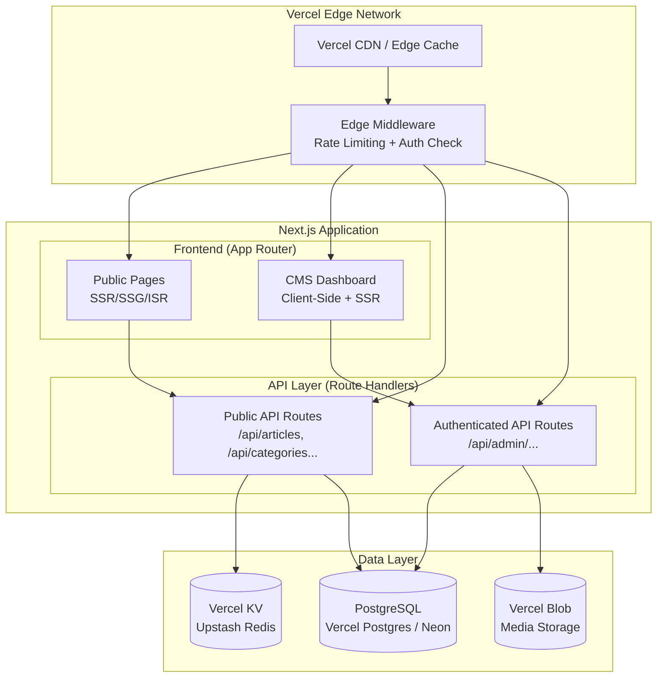
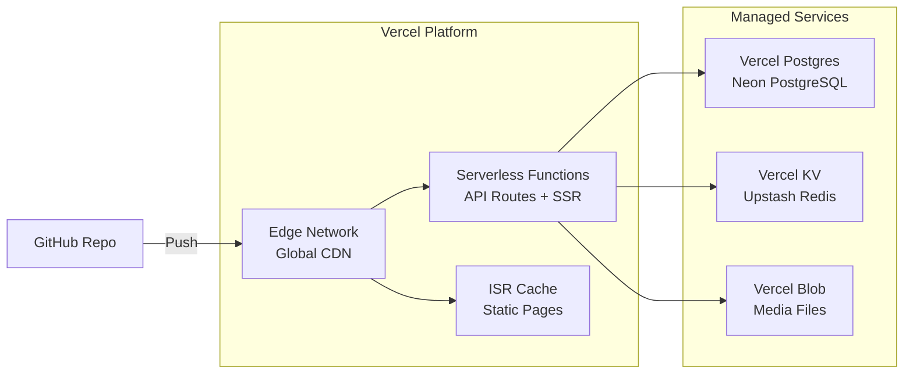
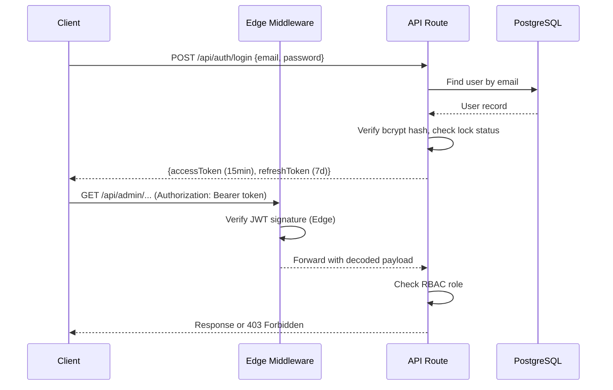

# Design Document: Tamil News Platform

## Overview

This design describes a modern, high-performance Tamil news platform deployed as a unified Next.js application on Vercel. The platform serves Tamil-speaking audiences with news content across categories (politics, sports, local, world), featuring a public-facing website with SSR/SSG/ISR rendering, a CMS dashboard for content management, and a REST API layer — all within a single Next.js codebase.

The architecture leverages Vercel's managed infrastructure:
- **Next.js App Router** for frontend pages and API routes (Vercel Serverless Functions)
- **PostgreSQL** (via Vercel Postgres / Neon) for persistent storage with Prisma ORM
- **Vercel KV** (Upstash Redis) for caching API responses and session data
- **Vercel Blob** for media/image storage
- **Edge Middleware** for rate limiting and auth token validation
- **Tailwind CSS** for responsive, mobile-first styling
- **JWT-based authentication** with RBAC (Admin, Editor, Author)
- Full **Tamil Unicode (UTF-8)** support throughout all layers

## Architecture

### System Architecture Diagram



### Data Flow

1. **Visitor Request**: CDN → Edge Middleware (rate limit check) → Next.js page (SSR/SSG/ISR) → API Route → Vercel KV cache check → PostgreSQL if cache miss → Response
2. **CMS Operation**: CMS UI → Authenticated API Route → JWT validation → RBAC check → Prisma → PostgreSQL → Cache invalidation (Vercel KV) → Response
3. **Media Upload**: CMS UI → Authenticated API Route → File validation → Vercel Blob upload → DB record creation → Response
4. **Search**: Search input → API Route → PostgreSQL full-text search (tsvector/tsquery with Tamil config) → Cached results → Response

### Deployment Architecture



## Components and Interfaces

### Frontend Components

```
src/
├── app/
│   ├── (public)/                  # Public route group
│   │   ├── page.tsx               # Home page (SSR)
│   │   ├── news/[slug]/page.tsx   # Article detail (ISR, 60s revalidate)
│   │   ├── category/[slug]/page.tsx # Category listing (ISR)
│   │   ├── tag/[slug]/page.tsx    # Tag listing (ISR)
│   │   ├── author/[slug]/page.tsx # Author profile (ISR)
│   │   ├── search/page.tsx        # Search results (SSR)
│   │   ├── archive/[year]/[month]/page.tsx # Archive (ISR)
│   │   ├── about/page.tsx         # Static (SSG)
│   │   ├── contact/page.tsx       # Static (SSG)
│   │   ├── privacy/page.tsx       # Static (SSG)
│   │   └── terms/page.tsx         # Static (SSG)
│   ├── (cms)/                     # CMS route group (authenticated)
│   │   ├── dashboard/page.tsx     # Admin dashboard
│   │   ├── articles/              # Article management
│   │   ├── categories/            # Category management
│   │   ├── tags/                  # Tag management
│   │   ├── users/                 # User management (Admin only)
│   │   ├── media/                 # Media library
│   │   ├── comments/              # Comment moderation
│   │   └── settings/              # Site settings (Admin only)
│   ├── api/                       # API Route Handlers
│   │   ├── articles/              # Public + authenticated article endpoints
│   │   ├── categories/            # Category endpoints
│   │   ├── tags/                  # Tag endpoints
│   │   ├── authors/               # Author endpoints
│   │   ├── auth/                  # Login, refresh, password reset
│   │   ├── comments/              # Comment endpoints
│   │   ├── media/                 # Media upload endpoints
│   │   ├── search/                # Search endpoint
│   │   ├── ingest/                # Content ingestion endpoint
│   │   └── settings/              # Site settings endpoint
│   ├── layout.tsx                 # Root layout (Tamil fonts, lang="ta")
│   ├── sitemap.ts                 # Dynamic sitemap generation
│   ├── robots.ts                  # robots.txt generation
│   └── feed/                      # RSS and JSON feed routes
├── components/
│   ├── ui/                        # Reusable UI primitives (Button, Input, Card, etc.)
│   ├── layout/                    # Header, Footer, Sidebar, BreakingNewsTicker
│   ├── article/                   # ArticleCard, ArticleList, ArticleDetail, RichTextRenderer
│   ├── cms/                       # CMS-specific components (Editor, DataTable, Forms)
│   ├── seo/                       # JsonLd, MetaTags, OpenGraph components
│   └── search/                    # SearchBar, SearchResults
├── lib/
│   ├── prisma.ts                  # Prisma client singleton
│   ├── cache.ts                   # Vercel KV cache helpers
│   ├── auth.ts                    # JWT sign/verify, RBAC middleware
│   ├── blob.ts                    # Vercel Blob upload helpers
│   ├── slug.ts                    # Tamil slug generator
│   ├── feed.ts                    # RSS/JSON feed generator
│   ├── search.ts                  # Search query builder
│   ├── serializer.ts              # Article serializer/deserializer
│   ├── parser.ts                  # Rich text article parser
│   ├── validators.ts              # Zod schemas for request validation
│   └── constants.ts               # App-wide constants
├── middleware.ts                   # Edge Middleware (rate limiting, auth)
└── prisma/
    ├── schema.prisma              # Database schema
    └── migrations/                # Migration files
```

### Key Interfaces

#### Authentication (`lib/auth.ts`)

```typescript
interface AuthPayload {
  userId: string;
  email: string;
  role: 'ADMIN' | 'EDITOR' | 'AUTHOR';
}

function signToken(payload: AuthPayload): string;
function verifyToken(token: string): AuthPayload | null;
function requireRole(...roles: Role[]): MiddlewareFunction;
```

#### Cache (`lib/cache.ts`)

```typescript
interface CacheOptions {
  ttl?: number;  // seconds, default 300
  tags?: string[]; // for targeted invalidation
}

function getCached<T>(key: string): Promise<T | null>;
function setCached<T>(key: string, value: T, options?: CacheOptions): Promise<void>;
function invalidateByTags(tags: string[]): Promise<void>;
```

#### Tamil Slug Generator (`lib/slug.ts`)

```typescript
function generateTamilSlug(title: string): string;
function isValidSlug(slug: string): boolean;
function reconstructTitle(slug: string): string;
```

#### Article Serializer (`lib/serializer.ts`)

```typescript
interface SerializedArticle {
  id: string;
  title: string;
  slug: string;
  content: string;
  excerpt: string;
  status: 'draft' | 'published' | 'archived';
  publishedAt: string | null;
  author: { id: string; name: string; slug: string };
  category: { id: string; name: string; slug: string };
  tags: Array<{ id: string; name: string; slug: string }>;
  featuredImage: string | null;
  createdAt: string;
  updatedAt: string;
}

function serializeArticle(article: PrismaArticle): SerializedArticle;
function deserializeArticle(json: SerializedArticle): ArticleInput;
```

#### Feed Generator (`lib/feed.ts`)

```typescript
function generateRssFeed(articles: SerializedArticle[]): string;
function parseRssFeed(xml: string): ArticleMetadata[];
function generateJsonFeed(articles: SerializedArticle[]): string;
```

### API Route Design

| Method | Route | Auth | Description |
|--------|-------|------|-------------|
| GET | `/api/articles` | No | List articles (paginated, filterable) |
| GET | `/api/articles/[slug]` | No | Get single article by slug |
| POST | `/api/articles` | Author+ | Create article |
| PUT | `/api/articles/[id]` | Author+ | Update article |
| DELETE | `/api/articles/[id]` | Editor+ | Delete article |
| GET | `/api/categories` | No | List categories |
| POST | `/api/categories` | Editor+ | Create category |
| PUT | `/api/categories/[id]` | Editor+ | Update category |
| DELETE | `/api/categories/[id]` | Admin | Delete category |
| GET | `/api/tags` | No | List tags |
| POST | `/api/tags` | Editor+ | Create tag |
| GET | `/api/authors` | No | List authors |
| GET | `/api/authors/[slug]` | No | Get author profile |
| POST | `/api/auth/login` | No | Login, returns JWT |
| POST | `/api/auth/refresh` | No | Refresh JWT |
| POST | `/api/auth/reset-password` | No | Request password reset |
| GET | `/api/search` | No | Full-text search |
| POST | `/api/comments` | No | Submit comment |
| GET | `/api/comments/[articleId]` | No | Get approved comments |
| PUT | `/api/comments/[id]/approve` | Editor+ | Approve comment |
| POST | `/api/media/upload` | Author+ | Upload media |
| POST | `/api/ingest` | Admin | Ingest external content |
| GET | `/api/settings` | Admin | Get site settings |
| PUT | `/api/settings` | Admin | Update site settings |

#### Paginated Response Format

```typescript
interface PaginatedResponse<T> {
  data: T[];
  total: number;
  page: number;
  pageSize: number;
  totalPages: number;
}
```

#### Error Response Format

```typescript
interface ErrorResponse {
  error: {
    code: string;
    message: string;
    details?: Record<string, string[]>;
  };
}
```


## Data Models

### Prisma Schema

```prisma
generator client {
  provider = "prisma-client-js"
}

datasource db {
  provider  = "postgresql"
  url       = env("POSTGRES_PRISMA_URL")
  directUrl = env("POSTGRES_URL_NON_POOLING")
}

model User {
  id             String    @id @default(cuid())
  email          String    @unique
  passwordHash   String    @map("password_hash")
  name           String
  slug           String    @unique
  role           Role      @default(AUTHOR)
  bio            String?   @db.Text
  profileImage   String?   @map("profile_image")
  socialLinks    Json?     @map("social_links")
  failedLogins   Int       @default(0) @map("failed_logins")
  lockedUntil    DateTime? @map("locked_until")
  createdAt      DateTime  @default(now()) @map("created_at")
  updatedAt      DateTime  @updatedAt @map("updated_at")

  articles       Article[]
  
  @@map("users")
}

enum Role {
  ADMIN
  EDITOR
  AUTHOR
}

model Article {
  id             String        @id @default(cuid())
  title          String
  slug           String        @unique
  content        String        @db.Text
  excerpt        String?       @db.Text
  status         ArticleStatus @default(DRAFT)
  isBreaking     Boolean       @default(false) @map("is_breaking")
  featuredImage  String?       @map("featured_image")
  sourceUrl      String?       @unique @map("source_url")
  publishedAt    DateTime?     @map("published_at")
  createdAt      DateTime      @default(now()) @map("created_at")
  updatedAt      DateTime      @updatedAt @map("updated_at")

  authorId       String        @map("author_id")
  author         User          @relation(fields: [authorId], references: [id])
  categoryId     String        @map("category_id")
  category       Category      @relation(fields: [categoryId], references: [id], onDelete: Restrict)
  tags           ArticleTag[]
  comments       Comment[]
  media          Media[]

  @@index([status, publishedAt(sort: Desc)])
  @@index([authorId])
  @@index([categoryId])
  @@map("articles")
}

enum ArticleStatus {
  DRAFT
  PUBLISHED
  ARCHIVED
}

model Category {
  id             String     @id @default(cuid())
  name           String
  slug           String     @unique
  description    String?    @db.Text
  parentId       String?    @map("parent_id")
  parent         Category?  @relation("CategoryHierarchy", fields: [parentId], references: [id])
  children       Category[] @relation("CategoryHierarchy")
  articles       Article[]
  createdAt      DateTime   @default(now()) @map("created_at")
  updatedAt      DateTime   @updatedAt @map("updated_at")

  @@map("categories")
}

model Tag {
  id             String       @id @default(cuid())
  name           String
  slug           String       @unique
  articles       ArticleTag[]
  createdAt      DateTime     @default(now()) @map("created_at")

  @@map("tags")
}

model ArticleTag {
  articleId      String   @map("article_id")
  tagId          String   @map("tag_id")
  article        Article  @relation(fields: [articleId], references: [id], onDelete: Cascade)
  tag            Tag      @relation(fields: [tagId], references: [id], onDelete: Cascade)

  @@id([articleId, tagId])
  @@map("article_tags")
}

model Comment {
  id             String        @id @default(cuid())
  displayName    String        @map("display_name")
  email          String
  content        String        @db.Text
  status         CommentStatus @default(PENDING)
  articleId      String        @map("article_id")
  article        Article       @relation(fields: [articleId], references: [id], onDelete: Cascade)
  createdAt      DateTime      @default(now()) @map("created_at")

  @@index([articleId, status])
  @@map("comments")
}

enum CommentStatus {
  PENDING
  APPROVED
  FLAGGED
  REJECTED
}

model Media {
  id             String   @id @default(cuid())
  filename       String
  originalUrl    String   @map("original_url")
  thumbnailUrl   String?  @map("thumbnail_url")
  mediumUrl      String?  @map("medium_url")
  largeUrl       String?  @map("large_url")
  mimeType       String   @map("mime_type")
  size           Int
  articleId      String?  @map("article_id")
  article        Article? @relation(fields: [articleId], references: [id], onDelete: SetNull)
  createdAt      DateTime @default(now()) @map("created_at")

  @@map("media")
}

model SiteSetting {
  id             String   @id @default(cuid())
  key            String   @unique
  value          String   @db.Text
  updatedAt      DateTime @updatedAt @map("updated_at")

  @@map("site_settings")
}

model IngestionLog {
  id             String   @id @default(cuid())
  sourceUrl      String   @map("source_url")
  status         String   // 'success' | 'failure'
  message        String?  @db.Text
  createdAt      DateTime @default(now()) @map("created_at")

  @@map("ingestion_logs")
}
```

### Full-Text Search Setup

PostgreSQL full-text search with Tamil support using a `tsvector` column on articles:

```sql
-- Add search vector column
ALTER TABLE articles ADD COLUMN search_vector tsvector;

-- Create GIN index for fast full-text search
CREATE INDEX articles_search_idx ON articles USING GIN(search_vector);

-- Trigger to auto-update search vector on insert/update
CREATE OR REPLACE FUNCTION articles_search_update() RETURNS trigger AS $$
BEGIN
  NEW.search_vector :=
    setweight(to_tsvector('simple', COALESCE(NEW.title, '')), 'A') ||
    setweight(to_tsvector('simple', COALESCE(NEW.excerpt, '')), 'B') ||
    setweight(to_tsvector('simple', COALESCE(NEW.content, '')), 'C');
  RETURN NEW;
END;
$$ LANGUAGE plpgsql;

CREATE TRIGGER articles_search_trigger
  BEFORE INSERT OR UPDATE ON articles
  FOR EACH ROW EXECUTE FUNCTION articles_search_update();
```

The `simple` text search configuration is used instead of language-specific configs because PostgreSQL does not have a built-in Tamil dictionary. The `simple` config tokenizes on whitespace and punctuation, which works well for Tamil Unicode text. For improved relevance, we weight title (A) > excerpt (B) > content (C).

### Caching Strategy (Vercel KV)

| Cache Key Pattern | TTL | Invalidation Trigger |
|---|---|---|
| `articles:list:{page}:{filters}` | 300s | Article create/update/delete |
| `articles:detail:{slug}` | 300s | Article update/delete |
| `categories:list` | 600s | Category create/update/delete |
| `tags:list` | 600s | Tag create/update/delete |
| `authors:list` | 600s | User update |
| `authors:detail:{slug}` | 600s | User update |
| `search:{query}:{page}` | 120s | Article create/update |
| `breaking:articles` | 60s | Article breaking status change |
| `settings:all` | 3600s | Settings update |

Cache invalidation uses tag-based invalidation. When an article is updated, all keys tagged with `articles` are invalidated. The `invalidateByTags` helper iterates stored key sets in Vercel KV.

### Media Storage (Vercel Blob)

Upload flow:
1. Client sends file to `POST /api/media/upload` with multipart form data
2. API route validates file type (JPEG, PNG, WebP, AVIF) and size (≤10MB)
3. Original file uploaded to Vercel Blob with unique filename (`{cuid}.{ext}`)
4. Server generates resized variants using `sharp`:
   - Thumbnail: 150px width
   - Medium: 600px width
   - Large: 1200px width
5. All variants uploaded to Vercel Blob
6. Media record created in PostgreSQL with URLs for all sizes
7. Response returns media record with all URLs

Blob path structure: `media/{articleId}/{cuid}-{size}.{ext}`

### Authentication Flow



- Access tokens: JWT signed with HS256, 15-minute expiry
- Refresh tokens: Stored in HttpOnly cookie, 7-day expiry, rotated on use
- Password hashing: bcrypt with cost factor 12
- Account lockout: 3 failed attempts → 15-minute lock (tracked in `failedLogins` / `lockedUntil` fields)
- Edge Middleware validates JWT signature on all `/api/admin/*` and `/(cms)/*` routes, rejecting invalid tokens before they reach serverless functions

### Rate Limiting (Edge Middleware)

Implemented in `middleware.ts` using Vercel KV for distributed counters:
- Public endpoints: 100 requests/minute per IP
- Authenticated endpoints: 30 requests/minute per user ID
- Sliding window algorithm using KV `INCR` with TTL

### SEO Implementation

1. **Meta Tags**: Each page exports `generateMetadata()` (App Router) returning title, description, Open Graph, and Twitter Card tags
2. **JSON-LD**: `<JsonLd>` component renders `schema.org/NewsArticle` structured data on article pages with headline, datePublished, author, publisher, image
3. **Canonical URLs**: Every page includes `<link rel="canonical">` via metadata
4. **Sitemap**: `app/sitemap.ts` dynamically generates sitemap.xml listing all published articles, categories, tags, and author pages
5. **robots.txt**: `app/robots.ts` allows crawling of public pages, disallows `/api/*` and `/(cms)/*`
6. **RSS Feed**: `app/feed/rss/route.ts` generates RSS 2.0 XML feed
7. **JSON Feed**: `app/feed/json/route.ts` generates JSON Feed 1.1

### Tamil Localization Approach

1. **Root Layout**: `<html lang="ta" dir="ltr">` on all public pages
2. **Fonts**: Noto Sans Tamil loaded via `next/font/google` with `display: swap`, applied as default body font via Tailwind config
3. **Slug Generation**: Tamil titles → transliterated Latin slugs using a mapping table (e.g., அ→a, க→ka). Fallback to percent-encoded Unicode if transliteration produces collisions. Uniqueness enforced by DB unique constraint with suffix counter.
4. **Database**: PostgreSQL with UTF-8 encoding natively supports Tamil Unicode (U+0B80–U+0BFF). All text columns use `Text` type.
5. **Search**: `simple` tsvector config tokenizes Tamil text on whitespace/punctuation boundaries. Queries use `plainto_tsquery('simple', query)` for Unicode-aware matching.
6. **Input**: Rich text editor (Tiptap) configured with Tamil keyboard input support. No special IME handling needed — browsers handle Tamil input natively.
